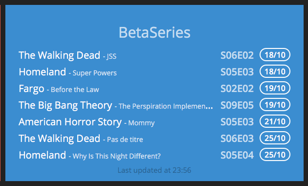

# dashing-betaseries

## Description

**dashing-betaseries** is a [Dashing](http://shopify.github.com/dashing) Widget to display your tv-shows airing next thanks to the [BetaSeries](https://www.betaseries.com/) API.

## Preview



## Usage

1. Copy the `betaseries` folder in your `widgets` folder.
2. Copy the `betaseries.rb` job file in your `jobs` folder.
3. Fill in your username and api key
4. Include this snippet in your dashboard layout file :

```
<li data-row="1" data-col="2" data-sizex="2" data-sizey="1">
  <div data-id="betaseries" data-view="Betaseries" data-title="BetaSeries"></div>
</li>
```

## Dependencies

[json](http://rubygems.org/gems/json)

Add it to dashing's gemfile:

```
gem 'json'
```

and run `bundle install`.


## Settings

You **need** to provide your own apikey and username. You can ask an apikey [on this page](http://www.betaseries.com/api/) for your own use.

You can set the number of episodes displayed by changing the limit variable.

Episodes are fetched every 6h by default but you can change it in the job file.

```
  SCHEDULER.every '6h', :first_in => 0 do |job|
```
